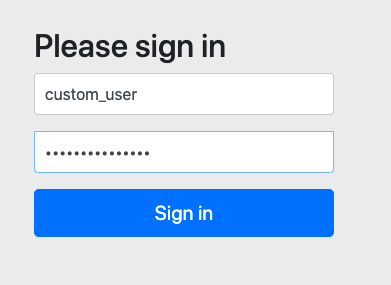
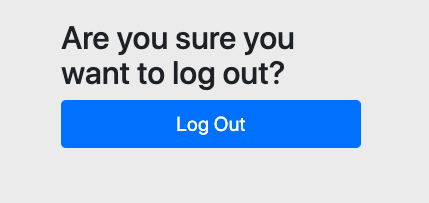

# Form Logging 적용하기. 

이제 Basic Auth 소스에서 Form Login 을 지원하도록 변경해 보자. 

MySecurityConfig.java 소스를 다음과 같이 수정한다. 

```go
    @Override
    protected void configure(HttpSecurity http) throws Exception {
        //  HttpSecurity 는 Basic Authentication 을 이용하겠다고 지정한다.
//        http.httpBasic();  // Basic Auth 용    
        http.formLogin();   // Form Login 용 

        //  인증된 요청만 통과하도록 지정한다.
//        http.authorizeRequests().anyRequest().authenticated();
        http.authorizeRequests().antMatchers("/users").authenticated();
    }
```

위 소스와 같이 `http.httpBasic()` 에서 `http.formLogin()` 으로 코드를 변경했다. 

그리고 `http.authorizeRequests().antMatchers("/users").authenticated();` 로 들어온 요청을 선별하여 인증을 걸어주자. 

서버를 다시 실행하자.

```go
./mvnw spring-boot:run
```

브라우저에서 http://localhost:8080/users 를 입력해보자. 

### 로그인폼

권한이 없으므로 바로 로그인 폼으로 이동 된다. 



전달되는 데이터는 다음과 같다. 

```go
username=custom_user&password=custom_user_123&_csrf=7ece6156-b5f6-468b-9875-2f87784b4639
```

즉 사용자 이름과 비밀번호를 전송 파라미터에 노출이 된다는 것을 주의하자. 

### 정상 로그인 

정상적으로 로그인되면 우리가 원하는 결과가 노출 된다. 


### 로그아웃 하기. 

이제 로그아웃을 해보자.. 

```go
http://localhost:8080/logout
```

위 경로를 url에 입력하면, 다음과 같이 로그아웃 관련 화면이 나타나고, 버튼을 누르면 로그아웃된다. 



## WrapUp

단순하게 http.httpBasic() 에서 http.formLogin() 으로 변경 한 경우 로그인 화면으로 이동 되는 것을 확인할 수 있었다. 

